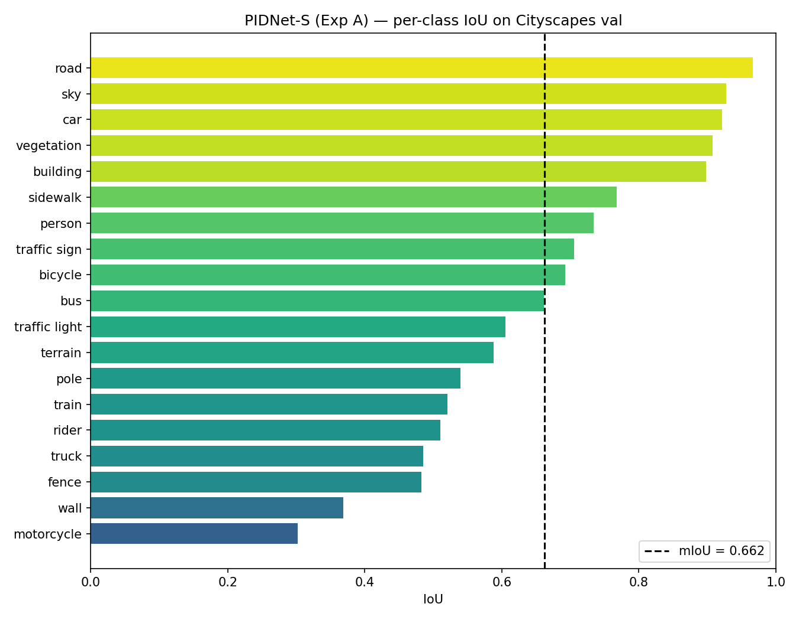
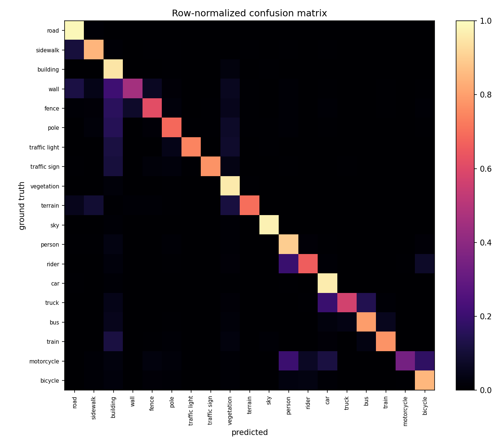
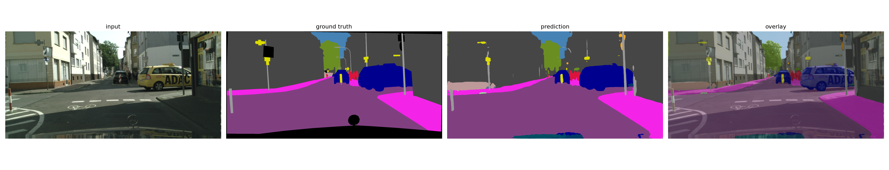
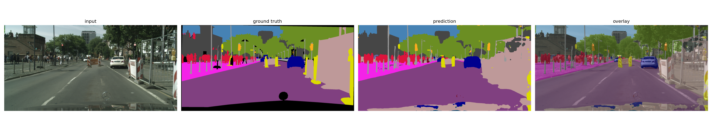
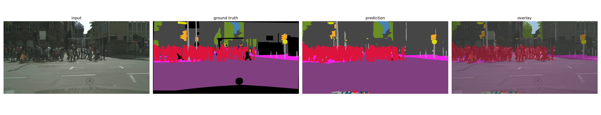
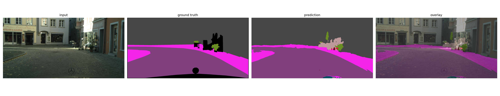

# Independent PyTorch reproduction of PIDNet-S on Cityscapes for real-time autonomous-driving scene understanding

An **independent PyTorch reproduction of PIDNet-S** for real-time semantic segmentation on the **Cityscapes** dataset. I implemented the model, training pipeline, evaluation code, and visualization workflow myself based on the architecture and methodology described in the PIDNet CVPR 2023 paper. **This repository does not use or copy the authors' implementation code.** The project focuses on reproducible training, class-wise evaluation, qualitative prediction analysis, and the accuracy–efficiency tradeoff relevant to autonomous-driving perception.

This work is based on:

> Jiacong Xu, Zixiang Xiong, and Shankar P. Bhattacharyya,  
> **“PIDNet: A Real-Time Semantic Segmentation Network Inspired by PID Controllers.”**  
> CVPR 2023.

- Paper: https://openaccess.thecvf.com/content/CVPR2023/html/Xu_PIDNet_A_Real-Time_Semantic_Segmentation_Network_Inspired_by_PID_Controllers_CVPR_2023_paper.html
> **Independent reproduction:** This project reproduces the PIDNet-S architecture from the paper using my own PyTorch code. It is not a fork of, modification of, or code copy from the authors' repository. The original paper is cited for the method and architecture; all implementation, training, evaluation, and experiment packaging in this repository were written independently for this project.

---

## Overview

Semantic segmentation assigns a semantic class to every pixel in an image. For autonomous driving, this allows a perception system to distinguish road surfaces, pedestrians, vehicles, traffic infrastructure, buildings, vegetation, and other elements of an urban scene.

PIDNet is designed specifically for **real-time semantic segmentation**. It separates spatial detail, contextual information, and boundary information into three coordinated branches:

- **P branch** — preserves high-resolution spatial features.
- **I branch** — captures semantic and contextual information.
- **D branch** — models boundary information to improve object separation.

This project trains PIDNet-S on the 19-class Cityscapes semantic-segmentation benchmark and evaluates both overall and class-specific performance.

---

## Project objectives

The project was built around four goals:

1. Independently reproduce and train PIDNet-S in PyTorch from the published paper on Cityscapes.
2. Evaluate segmentation quality using **mean Intersection over Union (mIoU)**, **pixel accuracy**, and **per-class IoU**.
3. Analyze how performance varies across large scene classes and smaller road users or infrastructure classes.
4. Create a clean, reproducible pipeline for training, evaluation, visualization, and single-image inference.

---

## Dataset

The experiments use the **Cityscapes** fine-annotation dataset with the standard 19 semantic classes:

`road`, `sidewalk`, `building`, `wall`, `fence`, `pole`, `traffic light`, `traffic sign`, `vegetation`, `terrain`, `sky`, `person`, `rider`, `car`, `truck`, `bus`, `train`, `motorcycle`, and `bicycle`.

The standard split used in this project contains:

| Split | Images |
|---|---:|
| Train | 2,975 |
| Validation | 500 |
| Test | 1,525 |

Cityscapes is not distributed with this repository. The expected directory structure is:

```text
data/
├── leftImg8bit/
│   ├── train/
│   ├── val/
│   └── test/
└── gtFine/
    ├── train/
    ├── val/
    └── test/
```

The data loader maps the original Cityscapes label IDs to the standard 19 training classes used for semantic-segmentation evaluation.

---

## Experimental setup

The main experiment used the following configuration:

| Setting | Value |
|---|---:|
| Model | PIDNet-S |
| Dataset | Cityscapes |
| Training images | 2,975 |
| Validation images | 500 |
| Number of classes | 19 |
| Training epochs | 150 |
| Crop size | 1024 × 1024 |
| Base image size | 2048 |
| Batch size | 6 |
| Optimizer | SGD |
| Learning rate | 0.01 |
| Momentum | 0.9 |
| Weight decay | 5e-4 |
| LR schedule | Polynomial decay |
| OHEM | Enabled |
| Data augmentation | Multi-scale + horizontal flip |

### Difference from the original PIDNet training recipe

The architecture is intentionally kept close to PIDNet-S, but this repository uses a different experimental schedule from the original CVPR training setup.

| Item | Original PIDNet-S setup | This project |
|---|---:|---:|
| Architecture | PIDNet-S | PIDNet-S |
| Dataset | Cityscapes | Cityscapes |
| Classes | 19 | 19 |
| Crop size | 1024 × 1024 | 1024 × 1024 |
| Base size | 2048 | 2048 |
| Training length | 484 epochs | 150 epochs |
| Effective batch size | 12 | 6 |
| Optimizer | SGD | SGD |
| Base learning rate | 0.01 | 0.01 |
| OHEM | Yes | Yes |
| Multi-scale + flip | Yes | Yes |
| Evaluation | Official evaluator | Custom evaluator + saved metrics + figures |

Because the training duration and effective batch size differ from the original paper, the reported result in this repository should be interpreted as **the result of this independent reproduction under its own training configuration**, not as an attempt to exactly match the paper's final benchmark.

---

## Results

### Overall validation performance

| Metric | Result |
|---|---:|
| Validation mIoU | **66.24%** |
| Pixel accuracy | **94.24%** |

The original PIDNet repository reports a higher validation mIoU under its full training recipe. The result above corresponds specifically to the 150-epoch configuration used in this project.

### Per-class IoU

| Class | IoU |
|---|---:|
| road | **96.61%** |
| sidewalk | 76.78% |
| building | **89.82%** |
| wall | 36.86% |
| fence | 48.31% |
| pole | 53.92% |
| traffic light | 60.55% |
| traffic sign | 70.58% |
| vegetation | **90.77%** |
| terrain | 58.79% |
| sky | **92.73%** |
| person | 73.38% |
| rider | 51.02% |
| car | **92.18%** |
| truck | 48.53% |
| bus | 66.16% |
| train | 52.10% |
| motorcycle | 30.21% |
| bicycle | 69.28% |

The model performs especially well on large and frequent scene classes such as **road, sky, car, vegetation, and building**. Smaller or less frequent categories such as **motorcycle, rider, pole, traffic light, wall, and truck** are noticeably more challenging.

For the selected small or safety-relevant classes — `pole`, `traffic light`, `traffic sign`, `person`, `rider`, `motorcycle`, and `bicycle` — the average IoU is **58.42%**.

---

## Visual results

### Per-class IoU



### Confusion matrix



### Qualitative predictions

The figures below show representative validation examples produced by the trained model.

| Example | Prediction |
|---|---|
| 1 |  |
| 2 |  |
| 3 |  |
| 4 |  |

Additional prediction examples are available in [`results/figures/`](results/figures/).

---

## Error analysis

The class-wise results highlight a common challenge in real-time urban semantic segmentation: performance is much stronger for large, visually dominant classes than for compact or relatively rare objects.

The strongest categories in this experiment are:

- road — **96.61% IoU**
- sky — **92.73% IoU**
- car — **92.18% IoU**
- vegetation — **90.77% IoU**
- building — **89.82% IoU**

More difficult categories include:

- motorcycle — **30.21% IoU**
- wall — **36.86% IoU**
- fence — **48.31% IoU**
- truck — **48.53% IoU**
- rider — **51.02% IoU**
- train — **52.10% IoU**
- pole — **53.92% IoU**

These differences are useful for understanding where a lightweight segmentation network loses accuracy. Small objects occupy fewer pixels, can disappear during downsampling, and are often harder to separate from surrounding structures. Less frequent classes also provide fewer training examples than dominant classes such as road, building, vegetation, and car.

---

## Repository structure

```text
PIDNet_Cityscapes_Implementation/
├── README.md
├── LICENSE
├── NOTICE
├── CITATION.cff
├── requirements.txt
├── environment.yml
├── configs/
│   └── pidnet_s_cityscapes.yaml
├── data/
│   └── README.md
├── docs/
│   ├── REPRODUCTION.md
│   └── RESULTS.md
├── notebooks/
│   └── CITY_LANDSCAPE.ipynb
├── results/
│   ├── figures/
│   │   ├── confusion.png
│   │   ├── per_class_iou.png
│   │   └── qualitative_*.png
│   └── metrics/
│       ├── metrics.csv
│       └── metrics.npz
├── scripts/
│   ├── train.py
│   ├── evaluate.py
│   └── predict.py
├── src/
│   └── pidnet/
│       ├── model.py
│       ├── dataset.py
│       ├── losses.py
│       └── utils.py
├── tests/
└── weights/
    └── best.pt
```

---

## Installation

### Option 1 — Conda

```bash
conda env create -f environment.yml
conda activate pidnet-cityscapes
```

### Option 2 — pip

```bash
pip install -r requirements.txt
```

---

## Training

```bash
python scripts/train.py \
  --config configs/pidnet_s_cityscapes.yaml \
  --images-dir /path/to/leftImg8bit \
  --labels-dir /path/to/gtFine \
  --imagenet /path/to/PIDNet_S_ImageNet.pth.tar
```

To resume training:

```bash
python scripts/train.py \
  --config configs/pidnet_s_cityscapes.yaml \
  --images-dir /path/to/leftImg8bit \
  --labels-dir /path/to/gtFine \
  --resume
```

---

## Evaluation

```bash
python scripts/evaluate.py \
  --images-dir /path/to/leftImg8bit \
  --labels-dir /path/to/gtFine \
  --weights weights/best.pt
```

Evaluation outputs are written to the `results/` directory, including saved metrics and visualizations.

---

## Inference

Run inference on a single image:

```bash
python scripts/predict.py /path/to/image.png \
  --weights weights/best.pt \
  --output prediction.png
```

---

## Reproducibility

Key settings used for the main experiment:

```text
Random seed:             304
Optimizer:               SGD
Base learning rate:      0.01
Momentum:                0.9
Weight decay:            5e-4
Polynomial LR power:     0.9
OHEM threshold:          0.9
OHEM minimum kept:       131072
Boundary BCE coefficient: 20
```

See [`docs/REPRODUCTION.md`](docs/REPRODUCTION.md) for additional details.

---

## Key takeaways

- Independently reproduced PIDNet-S in PyTorch from the CVPR 2023 paper and built the complete Cityscapes training/evaluation pipeline without using the authors' implementation code.
- Trained and evaluated a 19-class urban-scene segmentation model using mIoU, pixel accuracy, and class-wise IoU.
- Achieved **66.24% validation mIoU** and **94.24% pixel accuracy** using a 150-epoch training schedule.
- Observed strong segmentation of large scene classes such as road, sky, car, vegetation, and building.
- Identified substantially lower IoU for several small or infrequent classes, including motorcycle, rider, pole, and traffic light.
- Added reusable scripts for training, evaluation, visualization, and single-image prediction.

---

## Citation

Citing the original PIDNet paper:

```bibtex
@inproceedings{xu2023pidnet,
  title={PIDNet: A Real-Time Semantic Segmentation Network Inspired by PID Controllers},
  author={Xu, Jiacong and Xiong, Zixiang and Bhattacharyya, Shankar P.},
  booktitle={Proceedings of the IEEE/CVF Conference on Computer Vision and Pattern Recognition},
  year={2023},
  doi={10.1109/CVPR52729.2023.01871}
}
```

---

## Attribution and repository usage

PIDNet and the underlying P/I/D architecture were introduced by Xu et al. in the CVPR 2023 paper cited above. This repository is an **independent reproduction written by me from the paper description**; it does **not** contain code copied from the authors' implementation.

**No open-source license or permission to reuse this repository is granted.** Unless I provide explicit written permission, the source code, trained weights, figures, documentation, and other original material in this repository may not be copied, modified, redistributed, republished, incorporated into another project, or used to create derivative works, except where applicable law or platform terms require otherwise. You may view the public repository for review and evaluation purposes.

Third-party datasets, papers, libraries, and other dependencies remain subject to their own licenses and terms. Cityscapes data is not distributed with this repository.
